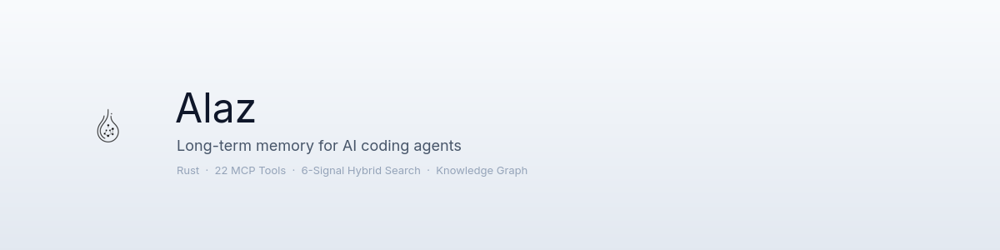

<p align="center">
  <picture>
    <source media="(prefers-color-scheme: dark)" srcset="docs/assets/banner-dark.png">
    <source media="(prefers-color-scheme: light)" srcset="docs/assets/banner-light.png">
    
  </picture>
</p>

<p align="center">
  <a href="https://github.com/Nonanti/Alaz/actions"></a>
  <a href="https://github.com/Nonanti/Alaz/blob/main/LICENSE"></a>
  
  
  
  <a href="https://crates.io/crates/alaz-cli"></a>
</p>

<p align="center">
  <a href="#quick-start">Quick Start</a> &middot;
  <a href="#how-it-works">How It Works</a> &middot;
  <a href="#search-pipeline">Search Pipeline</a> &middot;
  <a href="#mcp-tools">MCP Tools</a> &middot;
  <a href="docs/ARCHITECTURE.md">Architecture</a>
</p>

<br>

---

<br>

AI coding assistants forget everything when a session ends. You re-explain architecture, re-debug the same issues, re-teach the same patterns — every single time.

**Alaz fixes this.** It hooks into your coding sessions, learns automatically from transcripts, and injects the right context when a new session starts. Your assistant remembers what you built, what broke, what worked, and why.

> Single Rust binary · ~37K lines · 9 crates · 599 tests · 76 MCP tools · 6-signal hybrid search

### What's new in v2.0 — *Active Intelligence*

- **Active Intelligence layer** — Alaz goes from passive store to proactive collaborator: session-start context injection, on-demand CLAUDE.md generation, smart PostToolUse hooks.
- **Git-aware learning** — post-commit hook ingests diffs; hot-file and coupled-file analytics surface what actually changes together.
- **Dual LLM backend** — Ollama native (`think:false` fast path) with OpenAI-compatible fallback; run fully local or mix and match.
- **Higher-quality extraction** — minimum-quality gates, tighter extraction limits, contradiction-driven superseding with a 7-day grace period.
- **Cross-project promotion** — patterns seen in 3+ projects auto-promote with lowered thresholds for faster cross-pollination.
- **Implicit click tracking** — signal-weight learning feeds on real usage, no manual feedback required.

<br>

## How It Works

### Session ends — Alaz learns

The learning pipeline parses session transcripts and extracts structured knowledge automatically:

| What gets extracted | Description |
|---|---|
| **Patterns** | Reusable code solutions and architectural decisions |
| **Episodes** | Errors encountered, decisions made, discoveries found |
| **Procedures** | Step-by-step workflows, tracked with Wilson score confidence |
| **Core Memories** | Persistent facts, preferences, conventions, constraints |
| **Reflections** | What worked, what failed, lessons for next time |

The pipeline includes deduplication via pg_trgm similarity and vector distance, contradiction detection that automatically supersedes outdated knowledge, and cross-project promotion for patterns found in 3+ projects.

### Session starts — Alaz remembers

A priority-ranked context is injected at session start within an 8K token budget:

```
Unresolved issues          →  What's currently broken
Proven procedures          →  What reliably works (top Wilson scores)
Recent patterns            →  What was recently learned
Core memories              →  Facts, preferences, conventions
Cross-project intelligence →  Relevant knowledge from other projects
Recent code snippets       →  Contextually relevant code
Latest reflections         →  What to do differently this time
```

No manual tagging. No configuration. It just works.

<br>

## Search Pipeline

Most retrieval systems rely on a single signal — typically vector similarity. Alaz fuses **six orthogonal signals** concurrently via `tokio::join!`:

```
                          ┌─── FTS ──────────────── PostgreSQL tsvector
                          ├─── Dense Vector ─────── Qdrant cosine (4096-dim)
                Query ────├─── ColBERT MaxSim ───── Token-level multi-vector (128-dim)
                          ├─── Graph Expansion ──── 1-hop BFS from top candidates
                          ├─── RAPTOR ───────────── Hierarchical cluster summaries
                          └─── Memory Decay ─────── Recency × access frequency
                                      │
                                      ▼
                               RRF Fusion (k=60)
                                      │
                                      ▼
                            Cross-Encoder Rerank
                                      │
                                      ▼
                                   Results
```

Each signal captures a different relevance dimension:

| Signal | What it captures |
|---|---|
| **FTS** | Exact keyword and phrase matches |
| **Dense Vector** | Semantic similarity across the full document |
| **ColBERT MaxSim** | Token-level precision, especially effective for code |
| **Graph Expansion** | Structurally related knowledge via entity relations |
| **RAPTOR** | Conceptual similarity through hierarchical clustering |
| **Memory Decay** | Recency and access frequency — what's actively relevant |

If any backend goes down, the remaining signals still produce results. Graceful degradation, not failure.

<br>

## Comparison

| | Mem0 | Cognee | Zep | **Alaz** |
|---|---|---|---|---|
| Language | Python | Python | Python/Rust | **Rust** |
| Deployment | Cloud / Self-hosted | Self-hosted | Cloud / Self-hosted | **Single binary** |
| Search signals | 1–2 | 1–2 | 2–3 | **6** |
| ColBERT token-level search | — | — | — | Yes |
| RAPTOR clustering | — | — | — | Yes |
| Knowledge graph | — | Yes | — | Yes · 14+ relation types |
| Autonomous learning | — | — | — | Yes |
| Contradiction detection | — | — | — | Yes |
| MCP native | Plugin | — | — | Yes · 76 tools |
| Built for coding agents | — | — | — | Yes |
| Encrypted vault | — | — | — | AES-256-GCM |

<br>

## Quick Start

**Prerequisites:** [Rust](https://rustup.rs/) (2024 edition), [Docker](https://docs.docker.com/get-docker/)

```bash
git clone https://github.com/Nonanti/Alaz.git
cd Alaz

# Infrastructure — PostgreSQL, Qdrant, TEI Reranker, ColBERT
docker compose up -d

# Configure
cp .env.example .env
# Edit .env — set your LLM API key and JWT_SECRET

# Initialize
cargo run -- migrate
cargo run -- owner create --username your-name
cargo run -- apikey create --owner <owner-id>

# Run
cargo run -- serve
```

Server starts on `http://localhost:3456` with both REST API and MCP endpoints.

### Claude Code integration

Add to `~/.mcp.json`:

```json
{
  "mcpServers": {
    "alaz": {
      "type": "http",
      "url": "http://localhost:3456/mcp",
      "headers": {
        "X-API-Key": "your-api-key"
      }
    }
  }
}
```

Add session hooks to `~/.claude/settings.json`:

```json
{
  "hooks": {
    "SessionStart": [{
      "hooks": [{
        "type": "command",
        "command": "alaz hook start --project \"$PROJECT_NAME\"",
        "timeout": 10
      }]
    }],
    "Stop": [{
      "hooks": [{
        "type": "command",
        "command": "alaz hook stop --session-id \"$SESSION_ID\" --transcript \"$TRANSCRIPT\" --project \"$PROJECT_NAME\"",
        "timeout": 60
      }]
    }]
  }
}
```

That's it. Your AI assistant now has persistent memory.

<br>

## MCP Tools

76 tools exposed via MCP StreamableHTTP. Highlights below — see [`docs/API.md`](docs/API.md) for the full catalog.

<details>
<summary><strong>Knowledge Management</strong> — save, get, search, hybrid_search, list, update, delete</summary>

| Tool | Description |
|---|---|
| `alaz_save` | Save a knowledge item with auto-embedding and graph enrichment |
| `alaz_get` | Retrieve a knowledge item by ID |
| `alaz_search` | Full-text search across all knowledge |
| `alaz_hybrid_search` | 6-signal hybrid search with RRF, reranking, optional HyDE |
| `alaz_list` | List items with filters (type, project, language, tag) |
| `alaz_update` | Update an existing item |
| `alaz_delete` | Delete an item |

</details>

<details>
<summary><strong>Knowledge Graph</strong> — relate, unrelate, relations, graph_explore</summary>

| Tool | Description |
|---|---|
| `alaz_relate` | Create a directed relation between items |
| `alaz_unrelate` | Remove a relation |
| `alaz_relations` | Get relations with depth traversal |
| `alaz_graph_explore` | Multi-hop scored traversal across entity types |

</details>

<details>
<summary><strong>Episodic & Procedural Memory</strong> — episodes, procedures, core_memory, cue_search, episode_chain, episode_link</summary>

| Tool | Description |
|---|---|
| `alaz_episodes` | List episodes with type/severity/resolved filters |
| `alaz_procedures` | List procedures with Wilson score confidence |
| `alaz_core_memory` | Read persistent facts, preferences, conventions |
| `alaz_cue_search` | 5W episodic search (who, what, where, when, why) |
| `alaz_episode_chain` | Follow causal chain forward or backward |
| `alaz_episode_link` | Link two episodes causally |

</details>

<details>
<summary><strong>Search & Discovery</strong> — similar, cross_project, sessions</summary>

| Tool | Description |
|---|---|
| `alaz_similar` | Find similar entities by vector similarity |
| `alaz_cross_project` | Search knowledge across all projects |
| `alaz_sessions` | Query session history |

</details>

<details>
<summary><strong>Infrastructure & Vault</strong> — raptor, vault, checkpoints</summary>

| Tool | Description |
|---|---|
| `alaz_raptor_rebuild` | Rebuild RAPTOR hierarchical clustering tree |
| `alaz_raptor_status` | Check RAPTOR tree status |
| `alaz_vault_store` | Store an encrypted secret (AES-256-GCM) |
| `alaz_vault_get` | Retrieve and decrypt a secret |
| `alaz_vault_list` | List secret names |
| `alaz_vault_delete` | Delete a secret |
| `alaz_checkpoint_save` | Save session checkpoint |
| `alaz_checkpoint_list` | List checkpoints for a session |
| `alaz_checkpoint_restore` | Restore latest checkpoint |

</details>

<details>
<summary><strong>v2 — Active Intelligence</strong> — git, code, health, alerts, work units, observability</summary>

| Tool | Description |
|---|---|
| `alaz_git_hot_files` | Files most frequently changed in recent commits |
| `alaz_git_coupled_files` | Files that tend to change together |
| `alaz_git_timeline` | Timeline of commits for a project |
| `alaz_impact` | Blast-radius analysis for a symbol or file |
| `alaz_project_health` | Multi-dimensional project health score |
| `alaz_create_alert` / `alaz_list_alerts` / `alaz_alert_history` / `alaz_delete_alert` | Alert rules for code / errors / quality signals |
| `alaz_error_groups` / `alaz_error_group_detail` / `alaz_resolve_error` | Error tracking and grouping |
| `alaz_logs_query` / `alaz_logs_stats` | Ingested-log search and stats |
| `alaz_create_work_unit` / `alaz_list_work_units` / `alaz_update_work_unit` / `alaz_link_session_work_unit` | Work unit tracking tied to sessions |
| `alaz_rag_fusion` / `alaz_agentic_search` | Advanced retrieval strategies |
| `alaz_learning_analytics` / `alaz_search_analytics` | Insight into the learning pipeline |

</details>

<br>

## Architecture

```
alaz/
├── crates/
│   ├── alaz-core        Core types, errors, config, circuit breaker
│   ├── alaz-db          PostgreSQL · 18 migrations · repositories
│   ├── alaz-vector      Qdrant · dense (4096-dim) + ColBERT (128-dim)
│   ├── alaz-graph       Knowledge graph · causal chains · decay · promotion
│   ├── alaz-intel       LLM · embeddings · RAPTOR · HyDE · learner pipeline
│   ├── alaz-search      6-signal hybrid search · RRF · reranking
│   ├── alaz-auth        JWT · API keys · Argon2id · AES-256-GCM vault
│   ├── alaz-server      Axum HTTP + RMCP MCP server
│   └── alaz-cli         CLI — serve, migrate, hook, owner, apikey
├── services/
│   └── colbert-server   Python FastAPI sidecar for Jina-ColBERT-v2
└── docker-compose.yml   PostgreSQL · Qdrant · TEI · ColBERT
```

**Build order:** `core → db → vector → graph → intel → search → auth → server → cli`

See [ARCHITECTURE.md](docs/ARCHITECTURE.md) for the full deep-dive.

<br>

## Resilience

Alaz is designed for partial failure. When a service goes down, it adapts — not crashes.

| Service | Fallback behavior |
|---|---|
| Qdrant | FTS + Graph + RAPTOR continue (3/6 signals) |
| Ollama | Embeddings queued, retried via background job |
| TEI Reranker | Reranking skipped, RRF-scored results returned |
| ColBERT Server | ColBERT signal skipped, remaining 5 signals used |
| LLM API | Learning pipeline queued, HyDE disabled |

Circuit breaker: 5 consecutive failures → 60s backoff per service.

<br>

## Configuration

<details>
<summary>Environment variables</summary>

<br>

| Variable | Default | Description |
|---|---|---|
| `DATABASE_URL` | *(required)* | PostgreSQL connection string |
| `QDRANT_URL` | `http://localhost:6334` | Qdrant gRPC endpoint |
| `OLLAMA_URL` | `http://localhost:11434` | Ollama embedding service |
| `TEI_URL` | `http://localhost:8001` | TEI reranker endpoint |
| `COLBERT_URL` | `http://localhost:8002` | ColBERT server endpoint |
| `LLM_API_KEY` | *(required for learning)* | API key for any OpenAI-compatible LLM endpoint |
| `LLM_BASE_URL` | `http://localhost:11434/v1` | LLM base URL — Ollama, Z.AI, OpenAI, vLLM, LM Studio, … |
| `LLM_MODEL` | `qwen3:8b` | LLM model name |
| `TEXT_EMBED_MODEL` | `qwen3-embedding:8b` | Ollama embedding model |
| `TEXT_EMBED_DIM` | `4096` | Embedding dimension |
| `JWT_SECRET` | *(required)* | JWT signing secret |
| `VAULT_MASTER_KEY` | *(optional)* | 32-byte hex for vault encryption |
| `LISTEN_ADDR` | `0.0.0.0:3456` | Server listen address |

</details>

<br>

## Roadmap

- [x] **v2.0 — Active Intelligence** *(shipped)* — git integration, CLAUDE.md generator, dual LLM backend, smart hooks, implicit click tracking
- [x] Ollama-only mode — dual backend with native Ollama fast path
- [ ] Web dashboard for knowledge exploration
- [ ] VS Code / Cursor / Windsurf extensions
- [ ] Multi-user collaboration
- [ ] Pre-built Docker image
- [ ] Plugin system for custom extractors

<br>

## Contributing

Contributions welcome — see [CONTRIBUTING.md](CONTRIBUTING.md) for details.

```bash
cargo test --workspace
cargo clippy --workspace -- -D warnings
```

<br>

## License

[MIT](LICENSE)
